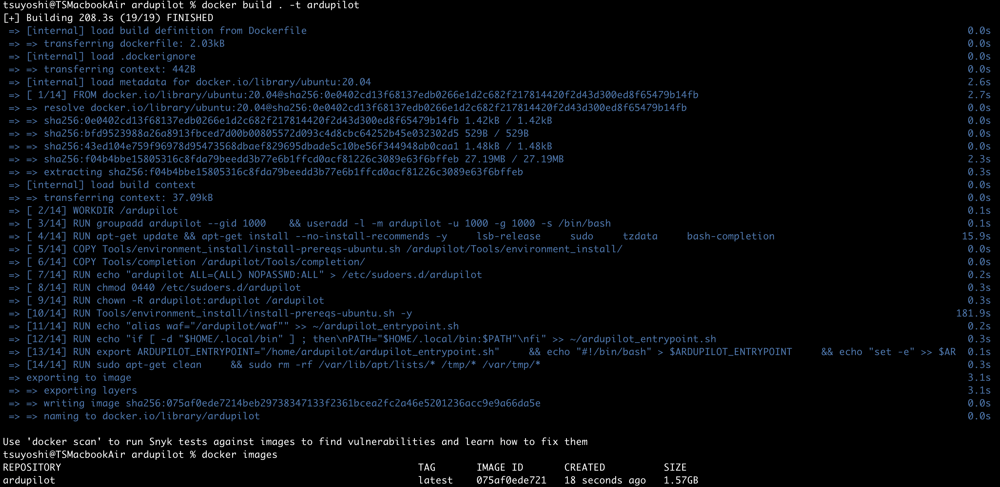

# ArduPilot SITL on Docker
DockerコンテナでArduPilotのSITLおよびビルドを実行するための環境構築手順です。

# 参考文献
- [https://discuss.ardupilot.org/t/ardupilot-and-docker-part-1/90532](https://discuss.ardupilot.org/t/ardupilot-and-docker-part-1/90532)
- [https://github.com/radarku/ardupilot-sitl-docker](https://github.com/radarku/ardupilot-sitl-docker)

# 留意事項
- Macでのビルドが遅いです。

# 手順
Dockerをインストールを必須とします。[https://docs.docker.com/engine/install/][https://docs.docker.com/engine/install/]を参考にしてインストールをしてください。<br/>
TODO 別ドキュメントにまとめる。

## 1. ArduPilotソースコードをクローン（１回のみ）
```
$ git clone https://github.com/ArduPilot/arduilot
$ cd ardupilot
$ git submodule update --init --recursive
```

## 2. Dockerイメージ作成（１回のみ）
```
$ docker build . -t ardupilot
```


## コンテナ起動（毎回）
コンテナが起動しコンテナ内に入る。<br/>
-p: ポート設定<br/>
-v: マウント設定<br/>
--rm: コンテナ削除（任意）
```
$ docker run -it -p 14550:14550/udp -v `pwd`:/ardupilot ardupilot:latest bash
※↓このようにプロンプトが変わる。
ardupilot@25b5653ae641:/ardupilot$
```


<span style="color:red">【注意】現状MAVProxy.pyのパスを手動でexportコマンドで都度通す必要がある。次のような表示になる。入力するのはexport PATH=$HOME/.local/bin:$PATHの部分のみ。</span>
```
ardupilot@25b5653ae641:/ardupilot$ export PATH=$HOME/.local/bin:$PATH
```

## SITL起動（毎回）
例えば、同じネットワーク（192.168.11.0/24）につながっているクライアント（192.168.11.20）にテレメトリーを接続させる場合は次のようなコマンドになります。
```
[Copterの場合]
ardupilot@25b5653ae641:/ardupilot$ sim_vehicle.py -v Copter --out 192.168.11.20:14550
```

## コンテナから出る
コンテナから抜けるのは簡単です。exitコマンドを実行するだけでよいです。コンテナを抜けた後でもコンテナは削除されません。
```
ardupilot@25b5653ae641:/ardupilot$ exit
```